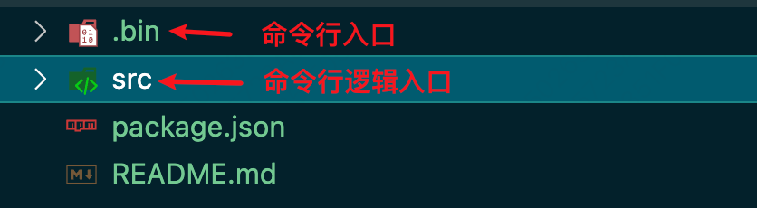
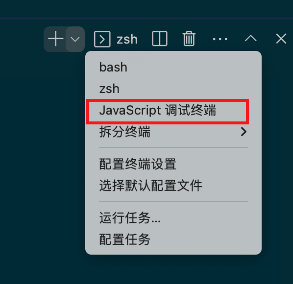
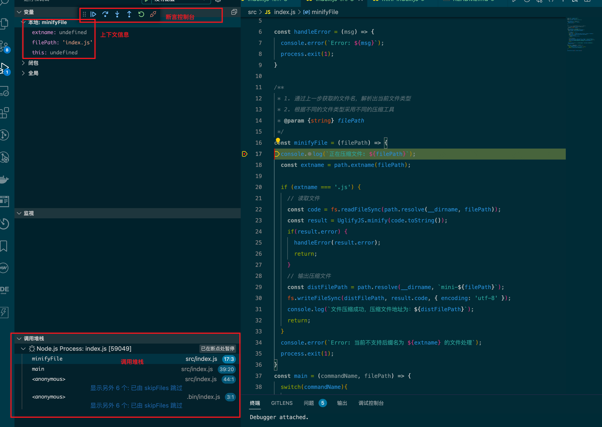

### 前言
> 本文会一步一步解析 node-CLI ，阅读完本文可以掌握，以下几个方面：
1. 了解 node-CLI 运行的基本原理
2. 掌握 CLI 的基本开发能力，能够制作简易的 CLI 工具

### 一、什么是 CLI

CLI（Command Line Interface）是指命令行界面，是一种通过命令行输入指令来操作计算机的方式。与 GUI（Graphical User Interface）相比，CLI 更加高效、灵活，可以通过编写脚本来自动化执行一系列操作，是开发者和系统管理员常用的工具。Web开发中，我们无时无刻都在使用CLI 辅助开发，提升操作效率，比如 git、npm、webpack、vite 等。

### 二、CLI 的应用场景有哪些
Node.js CLI 工具的应用场景非常广泛，以下是一些常见的应用场景：
- 自动化部署：可以编写 CLI 工具来自动化部署应用程序、配置服务器等操作，提高工作效率。
- 代码生成器：可以编写 CLI 工具来生成代码模板，例如创建一个新的 React 组件、生成一个 Express.js 项目等。
- 数据处理工具：可以编写 CLI 工具来处理数据，例如将 CSV 文件转换为 JSON 格式、将图片压缩等。
- 命令行工具：可以编写 CLI 工具来提供命令行界面的功能，例如 Git、npm 等。
- 网络工具：可以编写 CLI 工具来测试网络连接、获取网站信息等。
- 性能测试工具：可以编写 CLI 工具来测试应用程序的性能，例如压力测试、基准测试等。

总之，Node.js CLI 工具可以帮助我们更高效的操作计算机系统。工作中，我们可以我们将有规律可循的、重复的、繁琐的、模板化的工作，集成到 CLI 工具中。一个命令，即可快速的完成一些列操作

### 三、CLI 的运行原理
Node.js CLI 工具的运行原理比较简单，它们本质上就是一个 Node.js 程序，可以通过命令行输入参数来控制程序的行为。Node.js 提供了一个 `process.argv` 对象来获取命令行参数，可以通过解析该对象来实现不同的功能。核心运行步骤为以下几步
1. 解析命令行参数：Node.js 会解析命令行参数，并将其存储在 process.argv 数组中。开发者可以使用该数组来获取命令行参数。
2. 解析命令：Node.js CLI 工具通常需要解析命令，例如 git commit 命令中的 commit。开发者可以使用第三方库来简化命令解析的过程，例如 yargs、commander 等。
3. 执行命令：根据解析出来的命令，Node.js CLI 工具会执行相应的操作。例如，如果解析出来的命令是 git commit，则 Node.js CLI 工具会执行提交操作。
4. 命令行交互：Node.js CLI 工具通常需要与用户进行交互，例如询问用户是否确认执行某个操作、输入用户名和密码等。Node.js 提供了多种方式来实现命令行交互，例如 readline 模块、inquirer 模块等。
5. 命令行输出：Node.js CLI 工具通常需要向命令行输出信息，例如输出操作结果、错误信息等。Node.js 提供了多种方式来实现命令行输出，例如 console.log 方法、process.stdout.write 方法、chalk 模块等。
6. 错误处理：Node.js CLI 工具需要对错误进行处理，例如捕获异常、输出错误信息等。开发者可以使用 try...catch 语句来捕获异常，使用 console.error 方法来输出错误信息。

### 四、如何开发一个 CLI 工具
以开发一个代码压缩工具为例，制作一个可以指定文件进行压缩的 CLI 工具
#### 初始化一个工程目录
通过 `npm init` 初始化好一个工程目录，根据功能划分，进行文件夹拆分


#### 定义命令文件
1. 创建命令行入口文件
  ```javaScript
  #!/usr/bin/env node
  // 这里就是告诉操作系统，要用 node 来运行这个文件
  console.log('this is node-cli')
  ```
2. 指定命令名称

  在 `package.json` 中指定执行文件，声明 `bin` 字段；格式为：`<command name>:<JS file Path>`
  ```
    {
      "bin": {
        "minify-file": "./bin/index.js"
      }
    }
  ```
3. 解析命令行参数

3.1 获取命令名称
上文我们有介绍，可以通过 `process.argv` 来获取命令行参数。
```javaScript
/*
* 获取命令参数，process.argv 返回一个数组
* 0: 当前运行的 node 环境
* 1: 当前执行的文件
* ...: 命令行参数
*/
// 注册命令
const minifyFile = (filePath) => {
  console.log(`正在压缩文件: ${filePath}`);
}
const main = (commandName, filePath) => {
  switch(commandName){
    case 'minify': minifyFile(filePath); return;
    default: console.error('该命令未注册')
  }
}

main(process.argv[2], process.argv[3])
```

3.2 压缩文件
根据文件类型，选择不同的压缩工具进行压缩
```javaScript
const handleError = (msg) => {
  console.error(`Error: ${msg}`);
  process.exit(1);
}
const rootPath = process.cwd();

/**
 * 1. 通过上一步获取的文件名，解析出当前文件类型
 * 2. 根据不同的文件类型采用不同的压缩工具
 * @param {string} filePath
 */
const minifyFile = (filePath) => {
  console.log(`正在压缩文件: ${filePath}`);
  const extname = path.extname(filePath);

  if (extname === '.js') {
    // 读取文件
    const code = fs.readFileSync(path.resolve(rootPath, filePath));
    const result = UglifyJS.minify(code.toString());
    if(result.error) {
      handleError(result.error);
      return;
    }
    // 输出压缩文件
    const distFilePath = path.resolve(rootPath, `mini-${filePath}`);
    fs.writeFileSync(distFilePath, result.code, { encoding: 'utf-8' });
    console.log(`文件压缩成功，压缩文件地址为：${distFilePath}`);
    return;
  }
  console.error(`Error: 当前不支持后缀名为 ${extname} 的文件处理`);
  process.exit(1);
}
```

3.4 调试 CLI 工具

通过 vscode 的 debug 工具，我们可以快捷的进行代码调试。
- 第一步打开 debug 终端

- 在 debug 终端运行对应命令
- 需要关注的地方打上断言


3.5 发布 CLI 工具

- 登录 npm 账户：npm login
- 发布 npm 包：npm publish

完成发布后，我们就可以愉快的使用我们的 cli 工具了。
使用 cli 命令分为两种
1. 全局安装：全局安装的npm，命令会自动注册在全局。如上述的 minify 命令，全局安装后，我们可以在终端任意地方使用该命令
2. 局部安装：局部安装后，只能在当前文件夹下使用，使用方式分为两种
- 在 `package.json` 中的 `scripts` 配置，配置完成后只需要执行 yarn minify 即可
``` json
  "scripts": {
    "minify": "minify ./src/index.js"
  },
```
- 直接调用，使用 `node_modules/.bin/minify index.js`


### 总结
通过上述的学习，我们可以简单总结一下如何开发使用一个 CLI 工具
1. 通过 argv 解析命令参数
2. 执行对应命令业务代码
3. npm 发布
4. 全局或局部安装使用


